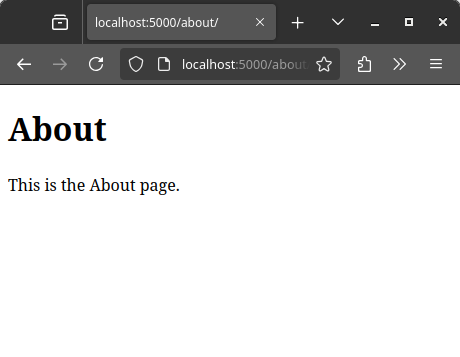

# Basic website with Python and Flask

## Setup

**Create the virtual environment**

```bash
python3 -m venv venv
source venv/bin/activate
```

**Install the required modules**

```bash
pip install flask
```

## Steps

### Create the new application and first route

```py
# app.py

from flask import Flask

app = Flask(__name__)

@app.route('/')
def home():
  return 'Hello World!'

if __name__ == '__main__':
  app.run(debug=True)
```

### Execute the script

```bash
python3 app.py
```

Open your web browser and navigate to [`http://localhost:5000/`](`http://localhost:5000/`) (the default port). You should see the `Hello World!` message on screen:


### Render a template

1. Create `templates/home.html` with a basic skeleton.

    ```html
    <!DOCTYPE html>

    <html>

      <body>
        <h1>Hello World!</h1>
        <p>Website is up!</p>
      </body>

    </html>
    ```

2. Import `render_template` from `flask` and use it in the corresponding route to load a file. Note that the path is not specified because it is searched in the `templates/` folder.

    ```py
    from flask import Flask, render_template

    app = Flask(__name__)

    @app.route('/')
    def home():
      return render_template('home.html')

    if __name__ == '__main__':
      app.run(debug=True)
    ```

3. Add a second route and make the script render a different file.

    ```py
    from flask import Flask, render_template

    app = Flask(__name__)

    @app.route('/')
    def home():
      return render_template('home.html')

    @app.route('/about/')
    def about():
      return render_template('about.html')

    if __name__ == '__main__':
      app.run(debug=True)
    ```

4. Open your web browser and navigate to [`http://localhost:5000/`](`http://localhost:5000/`) and [`http://localhost:5000/about/`](`http://localhost:5000/about/`). You will see the two pages rendered:

    

    

### Create a navigation menu

In order to have a navigation menu, we have to create a template.

1. Let's create a `templates/layout.html` file with a very basic navigation menu:

    ```html
    <!DOCTYPE html>

    <html>
      <body>
        <header>
          <div class="container">
            <h1 class="logo">My website</h1>
            <strong><nav>
              <ul class="menu">
                <li><a href="{{ url_for('home') }}">Home</a></li>
                <li><a href="{{ url_for('about') }}">About</a></li>
              </ul>
            </nav></strong>
          </div>
        </header>
        <div class="container">
          
          
        </div>
      </body>
    </html>
    ```

    If you open the `layout.html` file in your web browser, you will see this:

    

    Here, `` and `` are special tags that will be replaced by the actual webpage when rendered.

2. Now let's modify the `home.html` and `about.html` so that they contain only the body. In order for the pages to include the `layout.html` we use the special tag ``.

    ```html
    

    

    <div class="home">
      <h1>Hello World!</h1>
      <p>Website is up!</p>
    </div>

    
    ```

    ```html
    

    

    <div class="home">
      <h1>About</h1>
      <p>This is the About page.</p>
    </div>

    
    ```

3. Now reload the page, and it should look like this:

    

### Add CSS Styling

In order to add some visual styling, we'll create a CSS stylesheet.

1. Create a `static/css/main.css` file in the project folder, for example:

    ```CSS
    body {
      margin: 0;
      padding: 0;
      font-family: sans-serif;
      color: #ADD8E6; /* Light Blue */
      background-color: #000000; /* Black */
    }

    header {
      background-color: #191970; /* Midnight Blue */
      padding: 1rem 0;
      text-align: center;
    }

    .container {
      max-width: 960px;
      margin: 0 auto;
    }

    h1.logo {
      font-size: 2rem;
      color: #FFFFFF; /* White */
    }

    nav ul {
      list-style: none;
      padding: 0;
      margin: 0;
    }

    nav li {
      display: inline-block;
      margin-left: 20px;
    }

    nav a {
      color: #FFFFFF; /* White */
    }

    .home {
      padding: 2rem;
      text-align: center;
      background-color: #00008B; /* Navy */
      margin: 1rem auto;
      max-width: 600px;
      border-radius: 5px;
    }

    h1 {
      color: #708090; /* SlateGray */
    }

    p {
      color: #4169E1; /* Royal Blue */
    }
    ```

2. Add a `head` section to the `layout.html` file to include the stylesheet:

    ```html
    <head>
      <title>My Flask Website</title>
      <link rel="stylesheet" href={{ url_for('static', filename='css/main.css') }}>
    </head>
    ```

3. Reload the webpage.

    
  